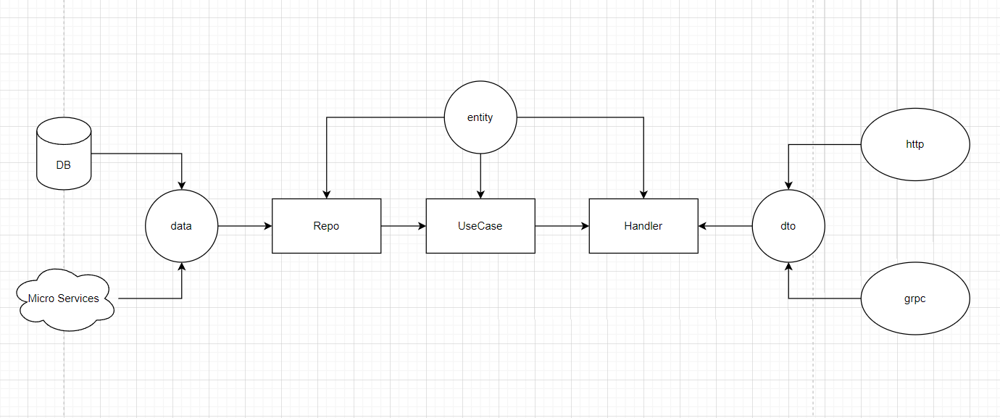

# clean
This is an example of clean architecture in GO. 
Note that this is the simplest example. 
In actual development, there are also modules such as logs, tracing, and monitoring, 
which need to be added according to your business

## tree
```
├─api           
│  ├─dto
│  └─handler
├─cmd
├─config
├─data
├─entity
├─test
└─usecase
```

## diagram


## blog
If you want to learn more details about my motivation to write this and follow my steps in doing so, check out [my blog post](https://lemon-1997.pages.dev/post/best-clean#more/) on the topic.